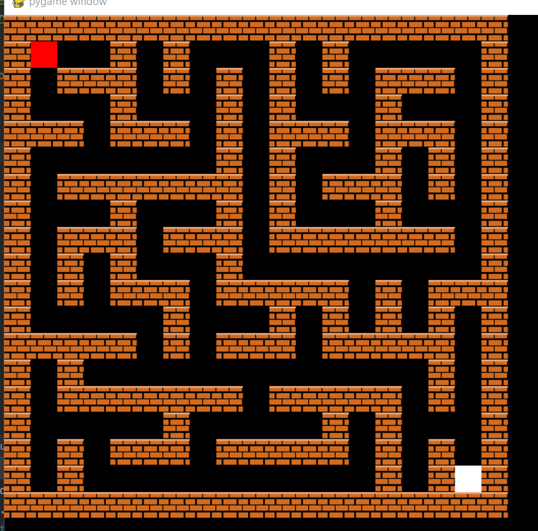

# SAÉ Graphe Labyrinthe 2022-2023
## Parent Arthur - Erwan Lecomte

### Sommaire:
- SAE Labyrithe
- Jeu labyrinthe

#### 1) SAE Labyrithe
Dans les fichiers ```Maze.py``` et ```testMaze.py``` vous trouverez respectivement un fichier contenant la classe Maze et les
méthodes répondants aux question de la SAE et dans le deuxième fichier nos tests qui nous on permis de tester nos
méthodes.

#### 2) Jeu labyrinthe

Dans le sous répertoire Jeu_pygame vous trourverez un jeu fait sous le module ```pygame```. 

Dans ce répertoire nous avons:

- ```Main.py```: fichier contenant la classe game et les méthodes pour jouer au jeu 
- ```Maze_pygame``` : même fichier que ``Maze.py``
- ```wall.png``` : image pour le jeu pygame

Si vous voulez jouer au Jeu -> exécutez le fichier ````Main.py````

Consigne: trouver la sortie du labyrinthe donnée par le carré blanc.

Touches:
- Z ou flèche du haut : mouvement vers le haut
- S ou flèche du bas : mouvement vers le bas
- Q ou flèche de gauche : mouvement vers la gauche
- D ou flèche de droite : mouvement vers la droite

Ps: Pour modifier la taille du labyrinthe , modifier les valeur de la méthode game() ligne 261
```python
jeu=game(4,4)
```
